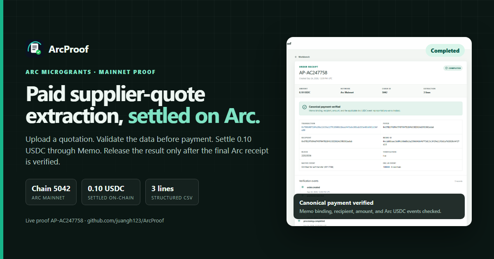
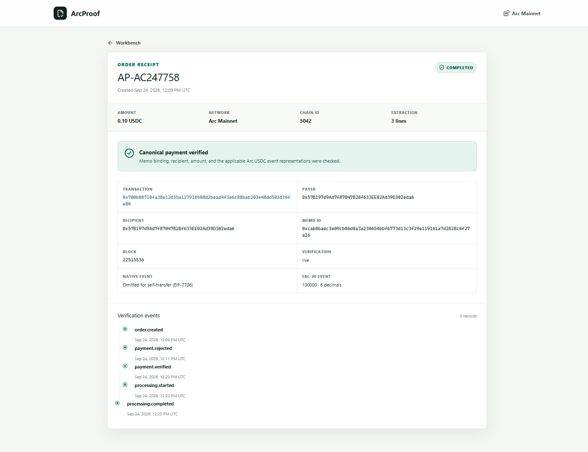

# ArcProof

[](https://github.com/juangh123/ArcProof/actions/workflows/ci.yml)
[](LICENSE)



ArcProof turns supplier quotation documents into structured purchasing data and releases the result only after a final USDC payment is verified on Arc.

The project is built for freelancers, small sourcing teams, and agent workflows that need a complete payment-to-delivery loop without a separate indexer or reconciliation spreadsheet.

## Live demo

- Application: https://arcproof-production.up.railway.app
- Arc Microgrants submission (Under Review): https://dorahacks.io/buidl/49114
- Demo video: https://github.com/juangh123/ArcProof/releases/download/v0.2.0/arcproof-demo.mp4
- Completed Arc Mainnet order: https://arcproof-production.up.railway.app/proof/AP-AC247758
- Mainnet transaction: `0x780b08710fa38e12d35a117918508d2bead4f3e6c88bab203e48dd501d36fe80`
- CSV result: https://arcproof-production.up.railway.app/api/proof/AP-AC247758/csv

The completed order settled `0.10 USDC` on Arc Mainnet and returned three structured quotation lines.

The published proof is a self-test: the same EOA is both payer and recipient. Arc's EIP-7708 rule omits the native transfer event for that case, so this order is verified through the signed `Memo.memo` call plus the 6-decimal ERC-20 mirror. A payment from a separate payer wallet would additionally require the canonical 18-decimal native event.



## Payment guarantees

The server independently verifies:

- Arc network and Chain ID `5042` in production.
- The `Memo.memo` call and its order identifier.
- The nested USDC `transfer` call, recipient, and amount.
- The applicable EIP-7708 native USDC event at 18 decimals.
- The ERC-20 USDC mirror event at 6 decimals, without counting it twice.
- A successful final transaction receipt.
- Unique transaction use across all orders.
- Atomic order binding, so concurrent submissions cannot replace the first verified transaction.

The frontend never grants fulfillment based on its own transaction success state.

## Product flow

```text
Document upload or sample
        |
        v
Preflight extraction and validated draft
        |
        v
Order and random Arc memo created
        |
        v
Browser wallet calls Memo.memo(USDC.transfer(...))
        |
        v
Final Arc transaction verified by the server
        |
        v
Idempotent processing and CSV generation
        |
        v
Result plus public payment receipt
```

Documents that cannot produce a structured line item are rejected before an order or payment request is created. The validated draft stays server-side and is released only after the Arc payment is verified. Legacy failed jobs can be retried without another payment, and a processing lease allows recovery after an interrupted server request.

The active order and any submitted transaction hash are kept locally in the browser. Reloading the workbench resumes payment verification or quotation processing from the server-side order state, while the public receipt can recover a verified order from another browser or device.

## Stack

- Next.js 16 and React 19
- TypeScript
- Node.js 24
- Node's built-in SQLite (`node:sqlite`)
- Viem for Arc RPC, calldata encoding, and event verification
- `unpdf` for PDF text extraction
- Optional OpenAI model for structured extraction
- Playwright for desktop and mobile browser tests
- Railway with a persistent volume for the public deployment

## Local development

Requirements: Node.js 24 or newer and pnpm 12 or newer.

```bash
pnpm install
cp .env.example .env.local
pnpm dev
```

Open `http://localhost:3000`.

The checked-in environment template uses Arc Testnet and fixture payment mode for a complete local demonstration without a wallet. Fixture mode is disabled in production and when `ARC_NETWORK=mainnet`.

On Windows without Developer Mode, a local `pnpm build` can skip the
standalone symlink packaging step:

```powershell
$env:NEXT_STANDALONE="false"
pnpm build
```

CI and the production Docker image leave standalone output enabled.

## Environment

| Variable | Required | Purpose |
|---|---|---|
| `ARC_NETWORK` | Yes | `mainnet` or `testnet` |
| `ARC_PAYMENT_MODE` | No | `live` or non-production `fixture` |
| `ARC_RECIPIENT_ADDRESS` | Yes | Wallet receiving the USDC payment |
| `ARC_RPC_URL` | No | Server-side override for the default Arc RPC endpoint |
| `ARC_EXPLORER_URL` | No | Override the default explorer |
| `ARC_QUOTE_PRICE_USDC` | No | Fixed service price, default `0.10` |
| `OPENAI_API_KEY` | No | Enables model extraction |
| `OPENAI_MODEL` | No | Model name, default `gpt-5.6-terra` |
| `ARCPROOF_DATA_DIR` | No | SQLite directory, default `./data` |
| `ARCPROOF_DATABASE_PATH` | No | Full SQLite file path override |

Production environment:

```text
ARC_NETWORK=mainnet
ARC_PAYMENT_MODE=live
ARC_RECIPIENT_ADDRESS=<Arc mainnet EOA>
ARC_QUOTE_PRICE_USDC=0.10
ARCPROOF_DATA_DIR=/data
```

## Arc network parameters

| Network | Chain ID | USDC interface | Memo contract |
|---|---:|---|---|
| Arc Mainnet | `5042` | `0x3600000000000000000000000000000000000000` | `0x5294E9927c3306DcBaDb03fe70b92e01cCede505` |
| Arc Testnet | `5042002` | `0x3600000000000000000000000000000000000000` | `0x5294E9927c3306DcBaDb03fe70b92e01cCede505` |

The canonical native USDC emitter is `0xffffFFFfFFffffffffffffffFfFFFfffFFFfFFfE` and uses 18 decimals. The ERC-20 interface emits a 6-decimal mirror event. Arc's EIP-7708 implementation emits no native self-transfer log, so a payment where payer and recipient are the same EOA is verified through the ERC-20 mirror and the signed Memo transfer.

Only EOA wallets are supported by the initial Memo-based payment path. ERC-4337, Safe, and other smart contract wallets are intentionally out of scope for this version.

## Deployment

The repository includes a Node.js 24 Dockerfile and a Railway
Infrastructure as Code definition at `.railway/railway.ts`.

1. Create a Railway service from this repository.
2. Add a persistent volume mounted at `/data`.
3. Keep the service at one replica because SQLite is single-instance storage.
4. Set the production environment variables listed above.
5. Review and apply the Railway configuration with `railway config plan` and
   `railway config apply --yes`.
6. Wait for `/api/health` to return `ok: true`, Chain ID `5042`, `configured: true`, and the expected `quotePriceUsdc` price (`0.10`) before accepting payments.

The Railway-generated HTTPS URL is sufficient for the live deployment link.

## Verification

```bash
pnpm lint
pnpm typecheck
pnpm test
pnpm coverage
pnpm build
pnpm exec playwright install chromium
pnpm test:e2e
```

Before a mainnet deployment, run:

```bash
ARC_NETWORK=mainnet \
ARC_RECIPIENT_ADDRESS=0x... \
PUBLIC_BASE_URL=https://your-railway-domain \
pnpm preflight
```

PowerShell users can set the same values with `$env:ARC_NETWORK`, `$env:ARC_RECIPIENT_ADDRESS`, and `$env:PUBLIC_BASE_URL`.

Create a public smoke-test order after deployment:

```bash
PUBLIC_BASE_URL=https://your-railway-domain pnpm smoke create
```

After paying in the browser wallet, verify and process the transaction:

```bash
PUBLIC_BASE_URL=https://your-railway-domain \
pnpm smoke verify <ORDER_ID> <TRANSACTION_HASH>
```

The unit suite currently contains 81 passing tests and covers payment transaction uniqueness, pending-payment recovery, paid-draft release, pre-payment extraction rejection, failed-job retry, processing retry limits, processing lease fencing, order expiry and retention, stale payment-target rejection, cross-network verification rejection, configuration validation, request rate limiting and memory bounds, chunked-upload limits, upload-size preflight, file validation, PDF page pre-checks, public identifier entropy, wrong chain/Memo/recipient/amount cases, duplicate Arc event rejection, the two-event Arc USDC model, verification claim atomicity, RPC-layer verification outcomes (pending, wrong chain, RPC failure), the health probe, private and public order lookup, resume-processing outcomes, quotation extraction, monetary consistency, price defaulting, empty-result handling, scanned-PDF detection, pre-payment CSV withholding, and CSV formula neutralization.

Coverage is enforced in CI over the server and API layers (`src/lib/**`, `src/app/api/**`) at 80% statements, 70% branches, 88% functions, and 80% lines; the browser surface is covered by the Playwright suite.

The browser suite covers the complete sample flow and public receipt on desktop and a 390px mobile viewport.

## Privacy and limits

- Uploaded source files are not stored.
- The request body is capped at 8 MB plus multipart overhead, including chunked requests without a `Content-Length` header.
- PDFs are rejected above 50 pages before text extraction starts.
- Scanned or image-only PDFs are not OCRed; a text-based PDF or plain-text export is required.
- Extracted source text is discarded after preflight validation; the validated draft is held server-side until payment or expiry.
- Payment requests expire for new payments after seven days; the window is enforced in the browser. A payment that already exists on Arc is still verified after the window and the order is retained for manual resolution, while unpaid or rejected records are purged after 30 days.
- A failed fulfillment can be retried up to five times before it needs manual support.
- The public proof page exposes payment facts and aggregate result metadata only.
- The service does not provide custody, exchange, tax advice, or accounting services.
- The first version uses one fixed price, one application instance, and EOA wallets only.
- Permanent processing failures require a manual refund process before production use.

## Documentation

- [Architecture](docs/ARCHITECTURE.md)
- [Mainnet runbook](docs/MAINNET_RUNBOOK.md)
- [Operations](docs/OPERATIONS.md)
- [Submission](docs/SUBMISSION.md)
- [Arc Microgrants form answers](docs/DORAHACKS_SUBMISSION_ANSWERS.md)
- [DoraHacks BUIDL description](docs/DORAHACKS_BUIDL_DESCRIPTION.md)
- [Five-minute reviewer guide](docs/REVIEWER_GUIDE.md)
- [Three-minute demo](docs/DEMO.md)
- [v0.2.0 release notes](docs/RELEASE_NOTES_v0.2.0.md)

## License

MIT
