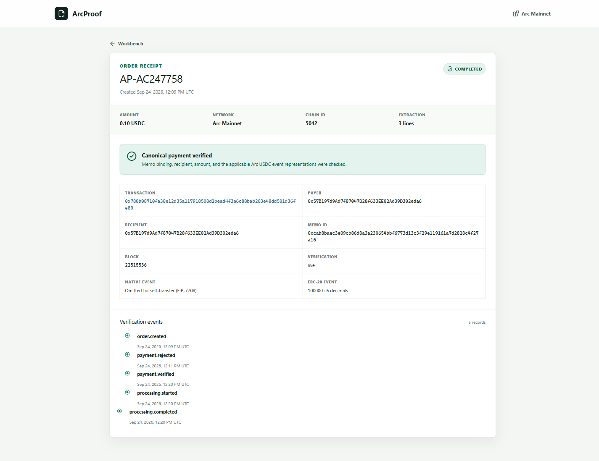

# Arc Microgrants Submission

## Project

ArcProof

## Live deployment

https://arcproof-production.up.railway.app

## Repository

https://github.com/juangh123/ArcProof

## Builder profile

https://github.com/juangh123

## Short description

ArcProof turns supplier quotation documents into structured, validated line-item data. A customer uploads a quote, sees the fixed USDC price, pays through the Arc Memo contract, and receives the extraction result only after the server independently verifies the final Arc transaction.

The project is a working Arc Mainnet application, not a mockup. It includes a live Railway deployment, a persistent SQLite order store, browser-wallet payment recovery, public receipts, CSV export, automated verification, and real settlement evidence.

## What Arc is used for

Arc is the settlement and proof layer rather than a decorative wallet button.

ArcProof verifies:

- Chain ID `5042` and the final transaction receipt.
- The Memo identifier that binds the payment to one order.
- The nested USDC transfer recipient and amount.
- The applicable 18-decimal native USDC event.
- The 6-decimal ERC-20 event without double counting it.
- Unique transaction use, so one payment cannot fulfill multiple orders.

ArcProof also handles Arc's EIP-7708 self-transfer rule: when the payer and recipient are the same EOA, the protocol omits the native self-transfer log, so the verifier uses the signed Memo transfer plus the ERC-20 mirror while normal transfers still require both event representations.

The result is released only after final settlement. Arc's deterministic finality removes the usual multi-confirmation and reorg window from the fulfillment path.

## Mainnet proof

- Completed order: `AP-AC247758`
- Transaction: https://explorer.arc.io/tx/0x780b08710fa38e12d35a117918508d2bead4f3e6c88bab203e48dd501d36fe80
- Transaction hash: `0x780b08710fa38e12d35a117918508d2bead4f3e6c88bab203e48dd501d36fe80`
- Public receipt: https://arcproof-production.up.railway.app/proof/AP-AC247758
- CSV output: https://arcproof-production.up.railway.app/api/orders/fc116601-6775-46aa-842a-c8d5eed5304a/csv
- Network: Arc Mainnet, Chain ID `5042`
- Settlement: `0.10 USDC`
- Result: three structured quotation lines

## Verification

The repository contains:

- 27 passing unit and integration tests.
- 8 passing Playwright browser tests across desktop and a 390px mobile viewport.
- A production build verified in CI and in the Railway Docker build.
- `pnpm preflight` checks for RPC chain ID, deployed USDC and Memo contracts, recipient balance, public health, database writability, and live payment mode.
- `pnpm smoke verify` checks a real transaction through the deployed verification and processing endpoints.

The public receipt records the final transaction, payer, recipient, Memo ID, block, payment amounts, and verification mode.

## Why it is worth continuing

Supplier quote normalization is a repeated, measurable workflow for small sourcing and e-commerce teams. ArcProof can begin as a paid document utility and evolve into a reusable payment, receipt, and fulfillment module for other document-heavy AI services.

## Current limitations

- EOA wallets only for the Memo payment path.
- One fixed price per quotation.
- PDF and text input only.
- Manual refund handling for permanent processing failures.

## Submission checklist

- [x] Live deployment on Arc Mainnet.
- [x] Public GitHub repository.
- [x] Public builder profile.
- [x] Completed real USDC payment and verification.
- [x] Public proof URL.
- [x] CSV output.
- [x] Automated tests and production deployment.
